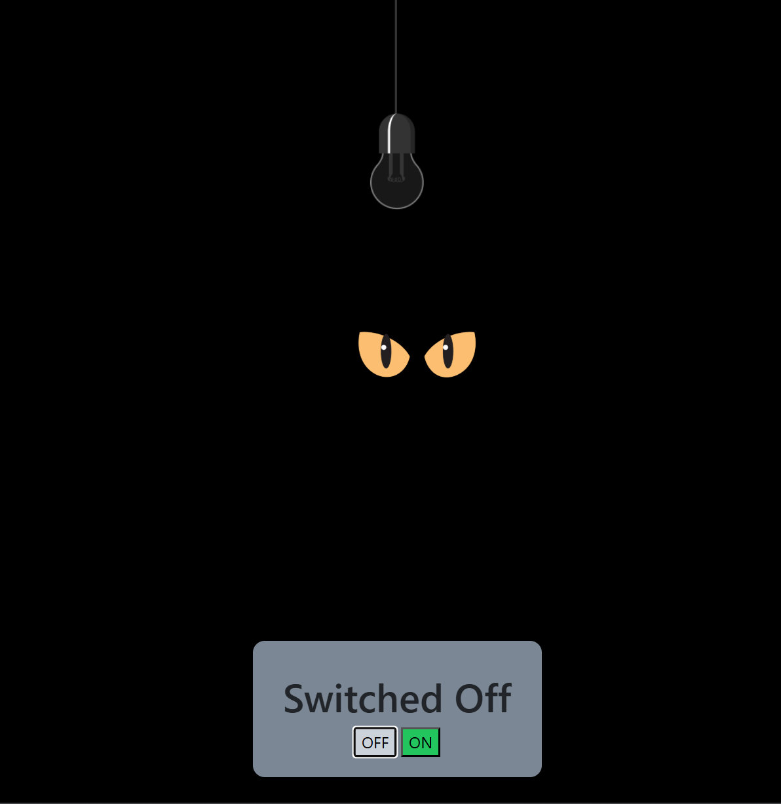
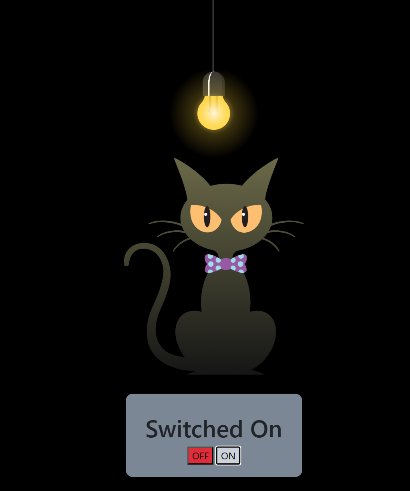

# JavaScript_learnings_1

-images URLs

[bulb-ON](https://d1tgh8fmlzexmh.cloudfront.net/ccbp-dynamic-webapps/bulb-go-on-img.png)
[bulb-OFF](https://d1tgh8fmlzexmh.cloudfront.net/ccbp-dynamic-webapps/bulb-go-off-img.png)

[cat-eyes](https://d1tgh8fmlzexmh.cloudfront.net/ccbp-dynamic-webapps/cat-eyes-img.png)
[cat](https://d1tgh8fmlzexmh.cloudfront.net/ccbp-dynamic-webapps/cat-img.png)

## Usage

```git
# clone this project into your local system

git clone https://github.com/siddu-369/JavaScript_learnings_1.git

```

## Sample Images




